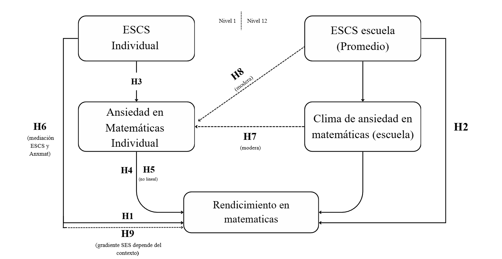

## Desigualdades y brecha socioeconómica en el rendimiento en Matemática

La literatura internacional y chilena ha avanzado significativamente en identificar los mecanismos mediante los cuales el origen social se traduce en diferencias de logro. En PISA 2022, Chile se ubica entre los países con mayores brechas de desempeño en Matemática por nivel socioeconómico, incluso controlando otras características individuales y escolares [@repec:eee:injoed:v:92:y:2022:i:c:s0738059322000785]. Este gradiente se observa de forma reiterada en diversas rondas de evaluaciones, lo que sugiere la presencia de mecanismos estructurales persistentes que vinculan el origen social con los logros en Matemática [@Global_Education_Monitoring_Report_Team2020-xq; @Neuman2022].

En el caso chileno, evidencia reciente muestra la persistencia de brechas de logro asociadas al origen social y la posición de clase [@MenesesOrtegaKuzmanicValenzuela2025]. Estudiantes de menor nivel socioeconómico tienden a concentrarse en establecimientos con peores resultados promedio y menor dotación de recursos, mientras que aquellos de origen favorecido asisten a escuelas que combinan mejores resultados académicos, mejor infraestructura y docentes con mayor experiencia [@UNESCO2020]. Informes de la @Agencia2023 confirman que estas brechas se reproducen curso a curso, de modo que el sistema escolar opera más como mecanismo de reproducción de la desigualdad que como instancia de compensación. A nivel comparado, Chile se mantiene entre los países de la OCDE con mayores niveles de desigualdad educativa, tanto en resultados de aprendizaje como en acceso a trayectorias diferenciadas [@CeronBolWerfhorst2022].

Desde la sociología de la educación, una parte central de la literatura enfatiza mecanismos asociados al capital cultural y la reproducción social. @BourdieuPasseron1977 sostienen que la escuela legitima como mérito las disposiciones culturales propias de las clases medias y altas, naturalizando las ventajas de quienes poseen habitus y capital cultural acordes a los códigos escolares. El éxito escolar se presenta como producto del esfuerzo individual, pero descansa en disposiciones adquiridas en el hogar, por ejemplo, el manejo del lenguaje académico o la familiaridad con las expectativas de los profesores [@Bourdieu2000]. Siguiendo esta línea, la brecha en Matemática refleja también la distancia entre los habitus de las y los estudiantes y las formas de relación con el conocimiento que la escuela privilegia [@BourdieuPasseron1977; @Bourdieu2000; @Bourdieu1979].

Siguiendo esta línea, @Lareau2003 complementa este enfoque al mostrar cómo los estilos de crianza diferenciados por clase producen desigualdades en vocabulario, manejo de normas institucionales y habilidades para desenvolverse en el sistema educativo. En familias de clases medias y altas se fomenta la participación en actividades extracurriculares y el razonamiento verbal, enseñando a argumentar y pedir explicaciones, mientras que en contextos de clase trabajadora la socialización cotidiana está menos orientada por la lógica escolar [@Lareau2003]. En Matemática, estas diferencias se traducen en la disponibilidad de apoyo familiar, materiales didácticos y oportunidades para naturalizar el razonamiento formal [@HascoetGiaconiJamain2021]. En consecuencia, la brecha de rendimiento no se explica sólo por carencias materiales, sino también por desigualdades en las formas de relación con el conocimiento y las instituciones [@Calarco2020]. Estudiantes de mayor nivel socioeconómico acceden a escuelas más dotadas y llegan a ellas con un capital cultural que facilita la comprensión de las lógicas evaluativas y la apropiación de los modos de pensamiento matemático valorizados [@OteroCarranzaContreras2021]. En cambio, quienes provienen de contextos desfavorables suelen enfrentar expectativas más bajas por parte del profesorado, lo que refuerza profecías autocumplidas de bajo desempeño [@article].

La literatura sobre efectos de composición y pares profundiza esta mirada al mostrar que, más allá de las características individuales, la composición socioeconómica de las escuelas incide en los aprendizajes a través de normas compartidas, expectativas colectivas y recursos pedagógicos comunes [@Willms2010]. Asistir a escuelas con mayor nivel socioeconómico promedio se asocia con mejores resultados, incluso para estudiantes de origen desfavorecido [@Kersha2020]. Además, la concentración de estudiantes de nivel socioeconómico alto genera entornos académicamente exigentes, con culturas orientadas a la continuidad de estudios y a la obtención de altos puntajes [@Willms1986]. Estos efectos de composición han sido formalizados mediante modelos jerárquicos que distinguen la varianza dentro y entre escuelas, permitiendo estimar con mayor precisión el peso de los factores contextuales [@RaudenbushBryk2002]. Los hallazgos indican que una fracción relevante de la desigualdad en Matemática se explica por diferencias entre escuelas, lo que sugiere que las oportunidades de aprendizaje dependen en buena medida del tipo de establecimiento. La composición socioeconómica opera así como un canal de distribución desigual de recursos materiales y simbólicos como docentes especializados, preparación para pruebas de alto impacto o redes académicas hacia la educación superior que favorecen a ciertos grupos [@OECD2023b].

La literatura sobre segregación escolar muestra que el sistema educativo chileno se organiza en circuitos fuertemente estratificados según nivel socioeconómico, dependencia y tipo de administración [@Agencia2023]. El financiamiento compartido, la selección académica y la libre elección de escuela han favorecido la formación homogénea de establecimientos de élite que concentran estudiantes de nivel socioeconómico alto, y escuelas municipales y subvencionadas que agrupan al estudiantado con mayores desventajas [@Bellei2013]. Ello limita el potencial integrador de la escuela y refuerza la concentración de desventajas, al reducir las oportunidades de interacción entre estudiantes de distinto origen y cristalizar circuitos de expectativas diferenciadas [@Valenzuela2014].

En este marco, la brecha socioeconómica en Matemática se inscribe en una estructura escolar segmentada, donde la trayectoria del estudiantado está en buena medida determinada por el tipo de establecimiento al que accede [@Bellei2013]. Las escuelas con mayores recursos pueden ofrecer reforzamientos intensivos, preparación específica para pruebas de selección y apoyo socioemocional, por su parte, escuelas en contextos de pobreza suelen operar con altas cargas docentes, recursos limitados y mayor rotación de profesores, afectando la calidad de la enseñanza [@inbook]. Una revisión reciente sintetiza la evidencia comparada sobre la relación entre estatus socioeconómico familiar y logro académico. Este análisis distingue entre los componentes estructurales del estatus (educación, ocupación e ingreso parental) y los patrones de inversión educativa, clasificando estos últimos en materiales (recursos culturales, tutorías, actividades extraescolares) y psicológicos (altas expectativas, apoyo emocional, clima de aprendizaje) [@guo2025sesreview]. @guo2025sesreview concluye que el capital académico y cultural incluye tanto bienes simbólicos como prácticas cotidianas de acompañamiento y participación en la vida escolar, reforzando la idea de que la desigualdad de rendimiento se enraíza en la estructura de oportunidades del hogar y en sus vínculos con la escuela.

Evidencia chilena reciente con SIMCE de Matemática (6.º a 10.º básico) muestra que el nivel socioeconómico del hogar, la composición socioeconómica del establecimiento y el rendimiento previo de la escuela se asocian positivamente con los puntajes; además, la pandemia amplió la brecha de género en Matemática, afectando particularmente a las niñas en escuelas de nivel socioeconómico alto y alto rendimiento previo [@MenesesOrtegaKuzmanicValenzuela2025]. Estos hallazgos se inscriben en un patrón más amplio documentado por los informes de factores asociados de la Agencia de Calidad de la Educación, que muestran la persistencia de brechas de aprendizaje según nivel socioeconómico y tipo de establecimiento en las pruebas SIMCE 2022 [@AgenciaCalidad2023Factores2022].

En otros contextos latinoamericanos también se observa la centralidad del nivel socioeconómico individual y de la composición escolar. Para Guatemala, se ha mostrado que el capital socioeconómico individual y el promedio socioeconómico de las escuelas se asocian positivamente con el rendimiento en Matemática, mientras que indicadores de desventaja como alta repitencia se vinculan con peores resultados [@Ortega2023-fi]. En Chile, estudios cuasi-experimentales sobre programas de apoyo a la primera infancia como Chile Crece Contigo evidencian efectos moderados en Lenguaje y Matemática hacia 4.º básico, sobre todo cuando la intervención ocurre en los primeros años de vida [@BucareyUgarteUrzua2014; @DIPRES2012ChCC; @Atalah2014]. Esto sugiere que el gradiente observado en la adolescencia comienza a configurarse tempranamente, y que políticas de apoyo inicial pueden amortiguar parcialmente sus efectos.

En suma, el nivel socioeconómico del hogar y la composición socioeconómica de la escuela aparecen como determinantes centrales de las desigualdades en Matemática, al organizar el acceso a recursos materiales y culturales y configurar normas y oportunidades de aprendizaje [@VANDEWERFHORST201822]. Sin embargo, los factores estructurales no explican por completo el vínculo entre el origen social y los resultados. En las últimas décadas, ha cobrado relevancia el estudio de procesos psicoeducativos que podrían mediar o modular estas desigualdades [@OECD2023b]. Entre ellos, la ansiedad en Matemática ha cobrado relevancia como un posible mecanismo de traducción de las desventajas de origen en un bajo rendimiento en esta asignatura [@HuangLiu2025], lo que abre paso al análisis de este constructo como foco central de la siguiente sección.

A partir de estos antecedentes teórico-empíricos sobre el gradiente socioeconómico y los efectos de composición, se proponen las siguientes hipótesis:

$H_{1}$: A mayor nivel socioeconómico del hogar (ESCS), mayor será el rendimiento en Matemática de las y los estudiantes.

$H_{2}$: A mayor nivel socioeconómico promedio del establecimiento, mayor será el rendimiento en Matemática del estudiantado.

$H_{3}$: Estudiantes de menor nivel socioeconómico tienden a presentar mayores niveles de ansiedad matemática que estudiantes de mayor nivel socioeconómico.

## Ansiedad en matemática y mecanismos psicológicos

La ansiedad en matemática se ha conceptualizado como un conjunto de emociones negativas como tensión, preocupación, incomodidad o temor que las personas experimentan al anticipar o enfrentar tareas que involucran números o cálculos, ya sea en contextos de clase, estudio o evaluación [@Dowker2016]. No se trata sólo de nervios puntuales antes de una prueba, sino de una respuesta relativamente estable que puede activarse al resolver problemas, participar en la pizarra, escuchar explicaciones poco comprensibles o proyectar trayectorias educativas futuras con cursos de Matemática [@AshcraftRidley2005]. Dicha respuesta suele ir acompañada de manifestaciones fisiológicas como palpitaciones, sudoración, malestar estomacal y cognitivas como pensamientos alarmantes o anticipación de fracaso, que se han documentado en la investigación sobre ansiedad matemática y en las escalas psicométricas empleadas para medirla [@Hembree1990].

Meta análisis y revisiones recientes muestran que la ansiedad matemática se asocia con un menor rendimiento en Matemática, incluso controlando la habilidad previa [@Barroso2021]. Esta relación aparece ya en la educación básica, se intensifica en la educación media y se mantiene en la educación superior, afectando el desempeño en cursos cuantitativos y la continuidad en carreras que requieren alta carga matemática [@madjar2018predictors]. A lo largo de la trayectoria escolar, estudiantes con mayor ansiedad tienden a mostrar menor satisfacción con la asignatura, menor intención de continuar en estudios que la involucran y menor probabilidad de optar por trayectorias STEM, aun cuando su desempeño objetivo sea comparable al de pares con menor ansiedad [@MaloneyBeilock2012].

En el plano cognitivo, la ansiedad interfiere con la memoria de trabajo, pues consume recursos atencionales y limita la capacidad para mantener y manipular información numérica, dificultando la resolución de problemas bajo presión [@AshcraftKrause2007]. El estudiantado debe simultáneamente resolver la tarea y lidiar con pensamientos negativos, reduciendo los recursos disponibles para el procesamiento. Esto se traduce en errores, dificultades para revisar el trabajo propio y tendencia a abandonar el problema [@Eysenck2007]. Estudios de neuroimagen muestran que ante tareas matemáticas, estudiantes con alta ansiedad activan regiones asociadas a la amenaza y el control emocional, y presentan patrones menos eficientes en áreas vinculadas al procesamiento numérico [@Young2012]. Lo anterior refuerza la idea de que la ansiedad involucra circuitos emocionales que compiten con los recursos cognitivos requeridos para el desempeño.

En el plano motivacional, la ansiedad matemática se vincula con la autoeficacia y las expectativas de logro. Según la teoría de la autoeficacia, las creencias sobre la propia capacidad influyen en el esfuerzo, la perseverancia y la forma de enfrentar las dificultades [@Bandura1997]. Estudiantes que se perciben poco capaces tienden a evitar la asignatura, reducir la práctica y abandonar con mayor facilidad ante errores o malos resultados [@Zimmerman2000]. La ansiedad refuerza este patrón al incrementar el rechazo a las situaciones asociadas a la Matemática, donde cada evaluación se vive como una amenaza a la identidad académica [@Pintrich2004]. Se configura así una dinámica en la que el malestar produce evitación, la evitación reduce las oportunidades de aprendizaje, la falta de dominio refuerza la percepción de incompetencia y ésta alimenta nuevas respuestas de ansiedad [@Carey2019].

La teoría de control valor de las emociones de logro, desarrollada por @Pekrun2006, plantea que emociones como la ansiedad emergen cuando las y los estudiantes perciben un bajo control sobre tareas consideradas importantes, lo que a su vez influye en su motivación, autorregulación y desempeño. En Matemática, contextos de enseñanza que enfatizan la velocidad, la respuesta única correcta, la evaluación sumativa y que castigan el error favorecen la percepción de bajo control [@boaler2019developing]. Al mismo tiempo, la asignatura suele ser vista como altamente valiosa por su relación con pruebas de alto impacto y el acceso a la educación superior [@Blok2016]. La combinación de bajo control percibido y alto valor se asocia con niveles elevados de ansiedad [@Dowker2016]. Además, la relación entre ansiedad y rendimiento puede no ser lineal, donde se observa que niveles muy bajos de ansiedad pueden vincularse a desinterés, mientras que niveles muy altos se asocian a caídas pronunciadas en el logro [@Carey2019].

Diversas intervenciones sugieren que estrategias relativamente simples como reinterpretar los síntomas fisiológicos de la ansiedad, realizar escritura expresiva de las preocupaciones antes de una prueba o entrenar estrategias metacognitivas pueden reducir la ansiedad y mejorar el desempeño, aunque sus efectos dependen del contexto y de la intensidad de la ansiedad [@geary2021class]. Sin embargo, una meta-análisis de 50 estudios reciente muestra que, en promedio, las intervenciones para reducir la ansiedad matemática tienen efectos moderados y una alta heterogeneidad entre estudios, por lo que su éxito depende de un diseño cuidadoso y de su articulación con cambios más amplios en la enseñanza y evaluación de la asignatura [@Sammallahti2023].

En cuanto a su medición, escalas como la Abbreviated Math Anxiety Scale (AMAS) distinguen entre la ansiedad frente al aprendizaje y frente a la evaluación, mostrando buenas propiedades psicométricas y adaptaciones a diversos idiomas [@hopko2003]. En contextos latinoamericanos se han validado versiones abreviadas con una consistencia interna aceptable, con medidas de autoeficacia y rendimiento, y estructuras factoriales similares a las halladas en otros países [@article1]. Además, estudios recientes con población infantil y adolescente muestran que la adaptación en español de la AMAS presenta una estructura factorial estable e invariancia de medida por género y nivel educativo, lo que permite realizar comparaciones válidas entre grupos escolares [@Martin-Puga2022-fg].

Investigaciones recientes subrayan, además, el rol de mecanismos psicoeducativos más amplios. Estudios basados en modelos de ecuaciones estructurales muestran que la calidad de la retroalimentación docente fortalece la autorregulación del aprendizaje, mediante una mayor interacción profesor-estudiante y un sentido más fuerte de pertenencia al curso [@TianHuiLei2025]. Estudiantes que se sienten escuchados y apoyados desarrollan mejores estrategias autorregulatorias y enfrentan la Matemática con menor ansiedad y mayor disposición a persistir [@OECD2025TeacherSupport]. De modo complementario, se ha encontrado que las estrategias de autorregulación como planificación y monitoreo se asocian de forma inversa con la ansiedad en contextos cuantitativos [@YoussefAlibraheim2025], lo que sugiere que la autorregulación puede operar como un factor protector frente a la ansiedad matemática.
Para concluir, la literatura sitúa la ansiedad matemática como un mecanismo en el que confluyen procesos cognitivos (memoria de trabajo, atención), motivacionales (autoeficacia, expectativas de control) y afectivos (temor al fracaso, amenaza de estereotipo), estrechamente vinculado al rendimiento escolar [@geary2021class]. Esto la convierte en una candidata plausible para mediar o modular la relación entre el origen social del estudiantado y sus resultados en Matemática, especialmente en sistemas altamente desiguales donde las experiencias de fracaso se concentran en determinados grupos socioeconómicos.

En función de la literatura sobre ansiedad matemática y sus mecanismos cognitivos y motivacionales, se plantean las siguientes hipótesis:

$H_{4}$: A mayores niveles de ansiedad matemática individual, menor será el rendimiento en Matemática del estudiantado.

$H_{5}$: La relación entre ansiedad matemática y rendimiento en Matemática presenta un comportamiento no lineal; niveles moderados de ansiedad pueden no afectar significativamente el rendimiento, pero niveles muy altos se asocian con caídas pronunciadas en el logro.

$H_{6}$: El nivel socioeconómico del hogar mediara el efecto de la ansiedad matemática en matematicas, por ende el nivel el rendimieto responde a esta mediacion.  el rendimiento en Matemática, de modo que parte del efecto del nivel socioeconómico sobre el rendimiento se explicará por diferencias en los niveles de ansiedad matemática.

## Contexto escolar, normas y climas afectivo-pedagógicos

El contexto escolar proporciona una estructura de oportunidades y normas que configura las prácticas de aula, las expectativas y los apoyos socioemocionales disponibles para el aprendizaje [@WangDegol2016]. En ese sentido, la composición socioeconómica de las escuelas opera tanto como recurso contextual al condicionar la infraestructura, los materiales y las redes educativas, como marco normativo que define estándares compartidos de esfuerzo y rendimiento entre pares [@RaudenbushBryk2002]. Estudios comparados muestran que las escuelas con mayor nivel socioeconómico promedio tienden a exhibir climas más exigentes, expectativas de continuidad de estudios más altas y entornos de apoyo más densos, ampliando las ventajas iniciales de los estudiantes favorecidos [@OECD2023b].

El clima de aula constituye otra dimensión central del contexto escolar. Se refiere a las percepciones compartidas sobre la calidad de las interacciones, las normas de convivencia, el apoyo pedagógico y las expectativas de logro [@Qiu2022]. Síntesis de investigación han mostrado que climas caracterizados por altas expectativas, apoyo pedagógico consistente, retroalimentación formativa y relaciones respetuosas se asocian sistemáticamente con mejores logros [@Hattie2009]. En Matemática específicamente, ambientes y contextos educativos donde el error se concibe como oportunidad de aprendizaje y se fomenta la participación se vinculan con mayor autoeficacia, menor evitación y actitudes más positivas hacia la asignatura [@OECD2023b], reduciendo la probabilidad de que se consoliden climas de alta ansiedad matemática.

Un componente específico, relevante para este estudio, es el clima de ansiedad matemática a nivel de escuela. Se refiere a la carga emocional promedio que experimentan las y los estudiantes frente a la Matemática, expresada en las formas de hablar de la asignatura, las reacciones colectivas ante evaluaciones y las prácticas de enseñanza que enfatizan el cumplimiento y la sanción por sobre la exploración [@geary2021class; @Stella2021]. En escuelas donde la asignatura se construye como un espacio de amenaza, la ansiedad deja de ser un rasgo individual para convertirse en una característica del clima institucional [@LinDurbinRancer2017]. Climas de alta ansiedad, marcados por la sensación de amenaza, la comparación social y la presión evaluativa, pueden amplificar el impacto de la ansiedad individual sobre el rendimiento [@RamirezShawMaloney2018], mientras que climas que promueven el apoyo, la colaboración y la resignificación del error tienden a atenuarlo [@OHara2022].

En Chile, investigaciones a gran escala han documentado tanto la magnitud de los efectos contextuales como el rol de ciertas políticas escolares. A partir de datos de 4.990 escuelas de 4.º básico, se ha mostrado que la composición socioeconómica se asocia con los resultados en Lectura y Matemática, y con los climas de convivencia. Asimismo, ciertos programas escolares pueden mediar parcialmente estas relaciones, especialmente en contextos de nivel socioeconómico bajo [@Delgado-Floody2024-dw]. Estudios multinivel con SIMCE de 2.º medio estiman que una proporción importante de la varianza en Matemática se ubica entre escuelas, y que el capital escolar de los pares (medido como la educación promedio de madres y padres) es uno de los predictores más fuertes del rendimiento institucional, mientras que ciertas formas de heterogeneidad se asocian a resultados más bajos [@Budnevich_Portales2020-wq]. Este tipo de patrones sugiere que los climas académicos y socioemocionales que emergen de dichas composiciones pueden incidir también en cómo se distribuye y se vive la ansiedad matemática en cada establecimiento.

Trabajos recientes basados en registros administrativos han explorado en qué medida las escuelas inciden en el gradiente socioeconómico del logro [@BorgenZachrissonSandsor2025]. Usando modelos multinivel con pendientes aleatorias para el ingreso parental, se observa que la brecha de rendimiento entre estudiantes de distinto nivel de ingreso varía significativamente entre escuelas. Esta variabilidad no se explica principalmente por la composición socioeconómica promedio, sino por indicadores de calidad escolar medidos como el valor agregado en el progreso de los estudiantes [@BorgenZachrissonSandsor2025]. En efecto, escuelas con mayor calidad pedagógica tienden a producir resultados más similares entre estudiantes de distinto origen social, lo que destaca un potencial rol igualador de ciertas prácticas y recursos, incluyendo formas de enseñanza y evaluación que podrían contribuir a climas de menor ansiedad matemática.

Otros estudios han extendido el análisis de la composición más allá del rendimiento inmediato y se han centrado en decisiones académicas posteriores. En Suecia, la proporción de compañeros con madres y padres altamente educados aumenta la probabilidad de que las y los estudiantes opten por vías académicas en la transición a la educación secundaria superior, incluso controlando su propio rendimiento [@10.1093/esr/jcae031]. Al mismo tiempo, la presencia de muchos estudiantes de alto rendimiento puede generar efectos de comparación social que desincentivan la elección de la vía académica entre quienes ya están en la parte alta de la distribución [@MarshHau2003]. Ello sugiere que la composición de pares influye tanto en el logro como en las expectativas y decisiones de largo plazo, pudiendo ser compensatoria para estudiantes de bajo nivel socioeconómico en entornos académicamente favorecedores, pero también potencialmente generadora de climas de presión y ansiedad para ciertos grupos.

La literatura sobre efectos de pares ha ido distinguiendo el peso relativo de la composición socioeconómica y la composición académica. Para Chile, estudios que controlan rigurosamente por el rendimiento previo e incorporan ambas dimensiones muestran que el nivel académico promedio de los pares ejerce un efecto sustantivo sobre el rendimiento en Matemática, mientras que el efecto del nivel socioeconómico promedio tiende a atenuarse [@Gutiérrez02012023]. Otros trabajos señalan que la exposición a pares de alto rendimiento puede tener efectos ambivalentes en el mediano y largo plazo, generando presiones competitivas que afectan el desempeño en pruebas exigentes [@BussoFrisancho2021]. Evidencia causal para Brasil, basada en variaciones exógenas en la composición de cursos, también apunta a efectos importantes de la composición académica sobre el aprendizaje en Matemática [@de2020peer]. En conjunto, estos estudios indican que la composición escolar importa tanto por la distribución del capital socioeconómico como por la calidad académica del entorno y las dinámicas de comparación social, dimensiones que se articulan con las formas en que se vive la ansiedad frente a la asignatura.

Estas diferencias de clima y composición entre tipos de establecimientos se superponen con la estratificación del sistema escolar chileno. Las escuelas particulares pagadas y ciertos colegios particulares subvencionados de élite concentran estudiantes de nivel socioeconómico alto y suelen ofrecer climas orientados a la selección y al alto desempeño en pruebas de ingreso a la educación superior, con una fuerte cultura de logro y competencia [@BelleiOrellanaCanales2020]. Muchas escuelas municipales y subvencionadas en contextos vulnerables operan en condiciones de inestabilidad, con recursos limitados y alta presión por resultados, sin contar siempre con los apoyos pedagógicos y socioemocionales necesarios [@Carvajal2022; @FalabellaDeLaVega2016]. En estos contextos, la Matemática puede vivirse simultáneamente como una asignatura clave para el futuro y como una fuente de ansiedad difícil de manejar, configurando climas emocionales especialmente tensos.

Tras la pandemia, evidencia reciente basada en datos globales de PISA muestra que la crisis sanitaria produjo pérdidas significativas de aprendizaje en Matemática, con efectos mayores entre estudiantes ya desaventajados, como aquellos de menor nivel socioeconómico, inmigrantes y varones [@Jakubowski2025-qv]. Estas dinámicas, sumadas a discursos sobre la “deuda de aprendizaje” y a condiciones de enseñanza tensionadas, probablemente intensificaron las percepciones de amenaza y los climas de alta ansiedad en torno a la asignatura [@WorldBank2021Deuda].

Desde una perspectiva multinivel, lo anterior permite conceptualizar la ansiedad matemática como un mecanismo que opera en varios niveles [@Lau2022]. A nivel individual, podría mediar la relación entre el nivel socioeconómico del hogar y el rendimiento, en la medida en que las trayectorias de socialización y las experiencias escolares influyen en cómo las y los estudiantes se sienten frente a la asignatura [@HuangLiu2025]. A nivel de escuela, la composición socioeconómica y el clima de ansiedad matemática pueden moderar el impacto de la ansiedad individual y del origen social sobre los resultados, amplificando o amortiguando las desigualdades según el tipo de establecimiento [@Lau2022; @Berkowitz2017]. La ansiedad matemática aparece así como un punto de articulación entre condiciones estructurales, dinámicas escolares y procesos psicológicos, constituyendo un foco privilegiado para comprender la producción de la desigualdad en el rendimiento en Matemática en un sistema altamente estratificado como el chileno.

A partir de estos antecedentes sobre composición escolar, clima de aula y clima de ansiedad matemática, se formulan las siguientes hipótesis de moderación:

$H_{7}$: El clima de ansiedad matemática del establecimiento modera la asociación entre la ansiedad matemática individual y el rendimiento en Matemática. En escuelas con climas de alta ansiedad matemática, el efecto negativo de la ansiedad individual sobre el rendimiento será más intenso que en escuelas con climas de baja ansiedad.

$H_{8}$: La composición socioeconómica de la escuela modera el efecto de la ansiedad matemática sobre el rendimiento, de modo que en escuelas con mayor nivel socioeconómico promedio el impacto negativo de la ansiedad individual sobre el rendimiento es menor que en escuelas con nivel socioeconómico promedio más bajo.

$H_{9}$: La brecha de rendimiento en Matemática entre estudiantes de distinto nivel socioeconómico varía según la composición socioeconómica y el clima de ansiedad matemática de la escuela. El gradiente socioeconómico será mayor en escuelas con alta concentración de desventajas y climas de alta ansiedad, y menor en escuelas con mayor capital escolar y climas de apoyo.

## Diagrama de hipótesis

A continuación se muestra el diagrama de hipótesis de la investigación: 

{ width=110%}

::: {.content-visible when-format="html"}

:::

